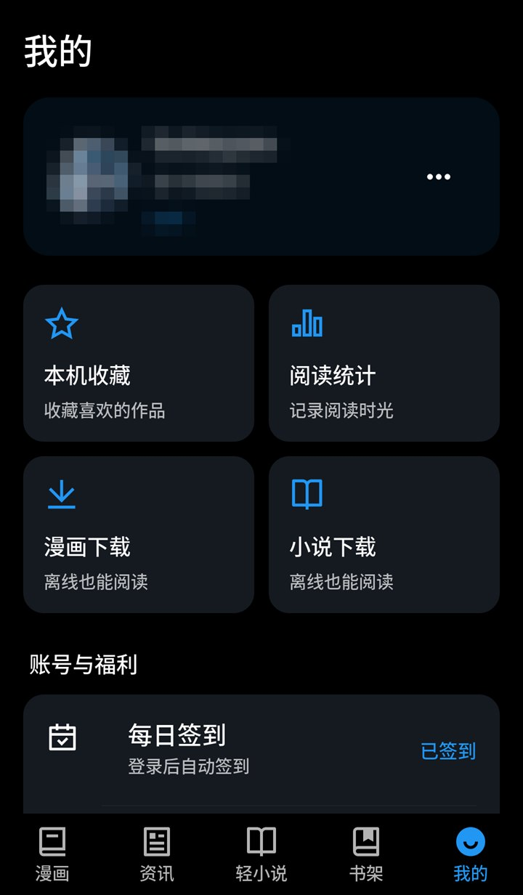

# 再漫画X（ZAI-X）

> **iOS 适配分支**：基于 funkeyyou v2.4.0，补充 iPhone / iPad 构建与平台适配。
> 安装、构建及验证范围见 [iOS 说明](docs/IOS.md)。在 Actions 运行 **Build iOS IPA**
> 可生成供个人证书重新签名的 IPA。下面保留上游项目介绍及 Android / Windows 下载链接。

[简体中文](README.md) · [繁體中文](README.zh-TW.md) · [English](README.en.md) · [下载 Releases](https://github.com/funkeyyou/zaimanhua/releases/latest) · [问题反馈](https://github.com/funkeyyou/zaimanhua/issues)

**再漫画（zaimanhua.com）的第三方客户端，Android 与 Windows 都能用。**

再漫画第三方客户端：看漫画、轻小说与资讯，支持 AI 搜索、神隐漫画、双页阅读与每日自动签到。
Unofficial Zaimanhua (再漫画) client for Android and Windows: manga, light novels and news.

- **AI 搜索**：用一句话描述想看的作品，例如“女主很强的奇幻冒险”“类似《葬送的芙莉莲》的作品”，AI 读完简介后挑出符合的漫画或轻小说，并写上推荐理由。
- **找得到神隐作品**：官方搜索找不到的神隐、下架漫画，由内置的本地索引补上，详情与完整章节都能打开。
- **大屏也好读**：折叠屏与平板自动双页对开、多列排版；Windows 支持键盘翻页，也能在 App 内自动更新。
- **书架与阅读进度**：按更新时间排序、筛选有未读更新的作品，阅读进度与再漫画账号同步。
- **打开 App 自动签到**：登录后打开 App，当天还没签到就会自动完成每日签到，并领取已达成的任务奖励；签到结果会用系统通知告诉你。

| 首页 | 书架：最近阅读与未读更新 | 我的：打开 App 已自动签到 |
| :---: | :---: | :---: |
|  |  |  |

| AI 搜索：读完简介再推荐 | 神隐作品：完整章节 |
| :---: | :---: |
|  |  |

*截图为 Android 版简体界面，App 内可切换为繁体中文；“我的”页的头像与昵称已打码。*

### 开始前需要什么？

Android 7.0 及以上的手机、平板或折叠屏，或者 Windows 10/11（64 位）电脑。
多数漫画、轻小说与资讯不登录也能看；订阅、阅读进度同步、签到与部分章节需要再漫画账号，在 App 内登录即可。
本项目是非官方的社区作品，与再漫画、动漫之家没有隶属关系。

### 数据从哪里来？

漫画、轻小说、资讯、评论与登录都直接连接再漫画官方接口。官方搜索找不到的神隐、下架作品，由 App 内置、每天更新的[本地漫画索引](docs/comic-index.md)补上。
版本更新读取本仓库的 GitHub Releases，默认经 gh-proxy 加速，连不上时改回 GitHub。
只有使用 AI 功能时才会向 AI 服务发送内容：AI 搜索发送你输入的描述，以及候选作品的书名、作者、题材、进度、人气与简介；AI 一键答题发送题目、选项，以及题目提到的作品在站内的公开资料。两者都不包含账号或阅读记录。

## 下载与安装

以下链接都指向[最新版本](https://github.com/funkeyyou/zaimanhua/releases/latest)：

| 平台 | GitHub 直接下载 | 经 gh-proxy 加速 |
| --- | --- | --- |
| Android | [ZAI-X-android.apk](https://github.com/funkeyyou/zaimanhua/releases/latest/download/ZAI-X-android.apk) | [ZAI-X-android.apk](https://gh-proxy.com/https://github.com/funkeyyou/zaimanhua/releases/latest/download/ZAI-X-android.apk) |
| Windows | [ZAI-X-windows-x64.zip](https://github.com/funkeyyou/zaimanhua/releases/latest/download/ZAI-X-windows-x64.zip) | [ZAI-X-windows-x64.zip](https://gh-proxy.com/https://github.com/funkeyyou/zaimanhua/releases/latest/download/ZAI-X-windows-x64.zip) |

GitHub 下载太慢时可以改用 gh-proxy（第三方加速服务）；下载后可对照 Release 页面列出的 SHA-256 校验文件。

### Android

下载 APK 后点击安装。首次安装时，系统会要求允许安装未知来源的应用。

### Windows

把 ZIP 解压到可写入的文件夹（例如 `D:\Apps\ZAI-X`），运行 `ZAI-X.exe`。免安装，也不需要管理员权限。

> 不要解压到 `C:\Program Files` 这类需要管理员权限的位置，否则 App 内更新无法自动覆盖，只能下载压缩包再手动解压。

## 更新

App 内“我的 → 检查更新”读取的是同一个 Releases，下载后会校验 SHA-256：

- **Android**：下载后调起系统安装程序覆盖安装，书架、记录与设置都会保留。
- **Windows**：v2.2.0 起可在 App 内自动覆盖更新。App 关闭后替换为新版并重新打开，任何一步失败都会还原到原来的版本。更早的版本请先关闭 App，把新版 ZIP 解压到原文件夹覆盖一次。

Windows 版的书架、记录、设置与下载内容保存在用户目录（AppData），更新或移动 App 文件夹都不会丢失。

当前最新版是 **v2.4.0**：新增用户等级页，题库认证可以交给 AI 一键答题，完整内容见[版本说明](docs/releases/v2.4.0.md)。各版本的更新内容见 [docs/releases](docs/releases) 与 [ROADMAP 的版本记录](docs/ROADMAP.md#版本紀錄)。

## 功能

### 搜索与发现

- **AI 搜索**：漫画与轻小说搜索页的开关。用一句话描述想看的作品，AI 先整理题材与条件、想出代表作，再从分类、官方搜索与本地漫画索引找出候选，读完简介后分成“符合”与“可能符合”并附上推荐理由；点“找更多作品”可以继续往下找。AI 搜索记录与普通搜索记录分开保存
- **神隐作品详情与章节**：可查看详情、完整章节与评论；无法阅读时提示是需要登录还是权限不足
- **本地漫画索引搜索**：补上官方搜索未收录的作品，内置离线快照并每天检查更新；可在“我的 → 更多设置 → 漫画”关闭或手动更新，来源及维护方式见[索引说明](docs/comic-index.md)
- **搜索历史与本地建议**：最多保留 20 条历史，可单条删除或清空；输入时匹配阅读记录与本地收藏，点击直接进入详情
- **专题合集**：首页“火热专题”的“漫画专题大合集”可浏览全部专题，各专题列出收录的漫画、推荐语与订阅状态；“订阅全部”只提交尚未订阅的作品（#3）

### 阅读器

- **双页对开**：折叠屏展开与平板横屏时自动启用，可强制开关，封面可单独成页
- **卷末预加载下一话**：读到只剩最后三页时提前获取内容与前两页图片，换话不必再等整屏加载
- **第一页往前翻**：回到上一话的最后一页，而不是第一页
- **卷末换话像翻页**：翻到最后一页再滑一下就换话，不必长拖再松开（上下滚动模式仍是拉一下松开，避免快速滚动时误跳）
- **翻页触控区宽度可调**：左右各 5–40%（上游 issue #157）
- **键盘翻页**：←/→ 与 PageUp/PageDown 只翻页，翻到头尾才换话
- **阅读时屏幕常亮**（可关）、**阅读器内亮度调节**（安卓/iOS，退出自动还原）
- **E-Ink 模式**：关闭翻页动画、页面转场与图片淡入，开启音量键翻页
- **已读章节标记**：详情页把看过的话变淡，长按可切换已读/未读、把某一话之前的一次标完，或清空整部
- **每部漫画独立阅读设置**：阅读器内调整方向、双页与封面排列只影响当前作品；未调整的选项沿用全局设置，可一键恢复全局
- **详情页阅读入口**：明确的开始/继续阅读按钮、上次阅读区域与章节进度

### 书架与订阅

- **书架页**：底部导航常驻入口；最上方一排是最近阅读，按屏幕宽度增加作品数，并显示上次的章节与页码，下方是我的订阅
- **订阅排序与筛选**：订阅时间/更新时间，支持升序降序；题材标签筛选（标签从漫画详情补充获取并缓存）
- **更新时间排序修正**：改用接口的 `last_updatetime`（章节 ID 不是全站递增，按它排序会把刚更新的作品排到后面），并设为默认排序
- **上次更新时间**：作品下方显示“6小时前”“1天前”，与官方书架一致
- **订阅更新提醒**（Android）：后台定期检查，有新话时发送通知
- **未读更新/已追平**：书架可按阅读进度筛选。点进详情不会清除提醒，最新一话末页成功加载并显示后才算追平；手动标记已读/未读也会同步反映
- **书架缓存与稳定刷新**：重开 App 先显示上次已排序的列表，再在后台更新；失败时保留缓存并提供重试。浏览到一半时用“查看更新”提示新列表，避免作品突然重排；缓存按登录账号隔离
- **浏览记录**：从书架右上角进入，本机记录可离线查看，登录后可切换到云端记录

### 分类与筛选

- **补齐隐藏标签**：官方分类接口只返回 37 个标签，ゆり、AA、纯爱、历史、战争、武侠、机战、福瑞等 18 个被隐藏；本分支收录完整的 55 个，并可用 [tools/tags](tools/tags) 一键重新抓取，不会过期
- **从详情页点隐藏标签能正确筛选**：以前点 ゆり 会退回“全部漫画”
- **状态筛选修复**：原本连载/完结提交的值是错的（而且被写死），实际完全不起作用
- **地区可与题材叠加**：地区改走独立参数，例如“日本 × 爱情”
- **筛选面板分组**：排序/状态/地区/受众/题材，附一键重置
- **自制标签封面**：18 个官方没有提供图片的标签，改用本仓库的原创封面（[assets/category](assets/category)）

### 账号与任务

- **打开 App 自动签到**：登录后打开 App，当天还没签到就会自动签到，并用系统通知（Windows 为桌面通知）告诉你结果，一天只提醒一次，可在设置里的“签到结果通知”关闭；“我的”页可以查看今天的签到状态，也能手动签到。不打开 App 也想签到的话，可以用独立的定时工具（[tools/auto_signin](tools/auto_signin)）。GitHub Actions 的每日定时任务默认停用，需要先添加 `ZMH_USERNAME`/`ZMH_PASSWORD` secrets 与 `ENABLE_DAILY_SIGNIN=1` variable
- **任务中心**：官方每日/新人任务的进度与奖励，可手动领取或一键领完；开启自动领取后，启动、离开阅读器、发完评论、订阅作品或回到前台时都会领取已达成的奖励。（官方“累计观看十分钟漫画”依靠官方 App 的行为日志统计，本 App 无法达成）
- **用户等级与 AI 一键答题**：点“我的”页的等级标签，可以查看当前等级的特权、晋升条件与题库认证上次的成绩。Lv4 升 Lv5 的“终极试炼之【题库认证】”可以交给 AI 作答：AI 先查询题目提到的作品在站内的资料，没把握的题目再想一次，一两分钟答完 50 题；可以选择交卷前先检查、修改答案。答案由 AI 判断，不保证过关，每台设备每天 5 次
- **个人资料编辑**：昵称（含官方能否修改与重名检查）、个性签名、性别、生日、所在地。官方接口不开放头像修改，仍需在官方 App 更换
- **阅读统计**：本机累计每日话数与阅读时长，包含今天/最近 7 天/总计、连续阅读天数与 7 天柱状图，不上传

### 界面、语言与大屏

- **界面语言切换**：跟随系统/简体/繁体（台湾用语），切换即时生效，无需重启 App
- **服务器内容实时简转繁**：漫画标题、资讯正文、小说正文、评论、板块标题、题材标签（OpenCC s2twp 全量词表，最长词优先）
- **内置思源黑体 Medium**：解决安卓默认中文字重过细、阅读吃力的问题
- **大屏适配**：宽屏主页使用完整宽度，空间足够时详情页并排；折叠与展开保留滚动位置；首页、专题与分类按宽度增加列数；底部导航附文字标签
- **性能**：封面按显示尺寸解码，阅读器正文保留完整分辨率；离线图片改用文件图片缓存；加载完成后移除隐藏的加载动画，未显示的标签页暂停动画计时

### 更新与发布

- **App 内一键更新**：检查与下载优先经 gh-proxy 加速，失败时回退到 GitHub；APK/ZIP 下载后校验 SHA-256。安卓调起系统安装程序；Windows 自动覆盖安装文件夹并重新打开，失败时还原原版本（安装在无法写入的位置时，改为下载压缩包后在资源管理器中选取）
- Android 正式签名发布，CI 自动打包

## 常见问题

### 搜索不到某部作品？

官方搜索不收录神隐与下架作品，App 会在搜索结果上方另外列出本地漫画索引找到的作品；索引可以在“我的 → 更多设置 → 漫画”手动更新。
知道作品 ID 的话（网页版网址 `manhua.zaimanhua.com/details/` 后面的数字），关闭 AI 搜索后在漫画搜索框输入这串数字，确认跳转就能打开该作品。

### 章节打不开，或显示“漫画不存在”？

v2.2.0 起神隐作品也能打开详情与章节。仍然无法阅读时，通常是需要登录或账号等级不足，详情页会说明是哪一种。

### 需要每天手动签到吗？

不用。登录后打开 App 就会自动完成当天的签到，并领取已达成的任务奖励；当天已经签过就不会重复签到。App 一直留在后台的话，要重新打开一次才会签到。当天不打算打开 App 的话，可以用 [tools/auto_signin](tools/auto_signin) 在电脑上定时签到。

### AI 搜索要付费或自备 API Key 吗？

不用。从 Releases 下载的版本已内置 AI 服务，每台设备每天可搜索 50 次（点“找更多作品”也算一次），同一段描述 30 分钟内重复搜索不另外计次。AI 一键答题也使用这个内置服务，每台设备每天 5 次。AI 服务额度有限，暂时无法使用时请改用普通搜索。
自行从源码构建时，需要提供自己的服务配置，见[开发](#开发)。

### Windows 自动更新失败？

先确认 App 放在可写入的文件夹。更新失败时会还原原来的版本，下次启动会提示结果；如果仍然失败，关闭 App 后把新版 ZIP 解压到原文件夹覆盖即可。

### 有 iOS、macOS 或 Linux 版吗？

目前只提供 Android 与 Windows 安装包。源码保留了其他平台的工程文件，但没有设备可以测试，需要的话请自行构建。

## 开发

- 开发原则：安卓优先，功能在安卓落地后再同步验证 Windows 版
- Flutter 3.47.2（本机与 CI 版本需一致）
- Windows 本机开发请使用纯 ASCII 路径：项目放在含中文的目录时，原生构建会读坏文件，`flutter analyze` 也会因 LSP 消息长度计算错误而抛出 `FormatException`。做法是建一个 junction，再从那里操作：
  ```cmd
  mklink /J C:\dev\zmh "D:\项目\再漫画"
  ```
  之后 `flutter analyze`/`flutter test`/`flutter build` 都在 `C:\dev\zmh` 下执行（同一份文件，git 操作留在原路径即可）。CI 运行在 ASCII 路径下，不受影响
- 新增中文界面字符串后运行 `tools/i18n/gen_dict.py` 重建简繁对照表；合并上游后另外运行 `tools/i18n/apply_i18n.py`
- AI 搜索需要兼容 OpenAI 的 `/chat/completions` 服务。把配置写成仓库外的 JSON，例如 `{"baseUrl": "https://example.com/v1", "apiKey": "...", "model": "..."}`，运行 `dart run tools/ai/make_ai_defines.dart --in <配置.json> --out <ai_defines.json>`，构建时加上 `--dart-define-from-file=<ai_defines.json>`。工具每次都用新的随机掩码混淆配置；CI 从 `ZAI_AI_CONFIG` secret 读取相同格式的 JSON。没有配置时，搜索页不会出现 AI 开关
- 安卓性能诊断：`flutter build apk --profile -t tools/profile_app.dart`，用 `adb logcat -s flutter` 过滤 `ZMH_PROFILE`；每 10 秒输出帧耗时、图片缓存与内存数字，不含账号或阅读内容。正式包仍使用 `lib/main.dart`
- 开发路线见 [docs/ROADMAP.md](docs/ROADMAP.md)，每个版本的验证记录在 `docs/QA-v*.md`
- 图标来源及重建方式见[品牌素材](assets/brand/README.md)，界面验证结果见 [UI 验证记录](docs/QA-2026-09-09-UI.md)

## 致谢与许可

- 源自 [xiaoyaocz/flutter_dmzj](https://github.com/xiaoyaocz/flutter_dmzj)（动漫之家第三方 Flutter 客户端），经 [Fusn126/ZAI_X](https://github.com/Fusn126/ZAI_X) 迁移到再漫画接口，本仓库在此基础上持续维护。
- 许可证：[GPL-3.0](LICENSE)，保留原作者署名；沿用原项目声明，禁止用于任何商业用途。

## 声明

- 本项目是[再漫画](https://www.zaimanhua.com)的第三方开源 App，与再漫画、动漫之家没有隶属关系。
- 本项目仅供学习交流编程技术，严禁用于商业目的；任何商业行为均与本项目无关。
- 作品内容与图片的版权归原作者及再漫画所有。
- 如果本项目侵犯了您的权益，请通过 [Issues](https://github.com/funkeyyou/zaimanhua/issues) 联系，会尽快处理并删除相关内容。
